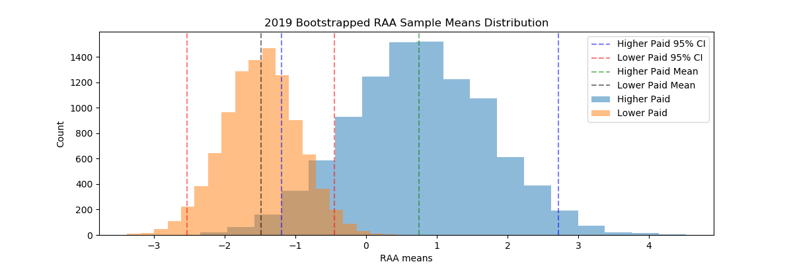
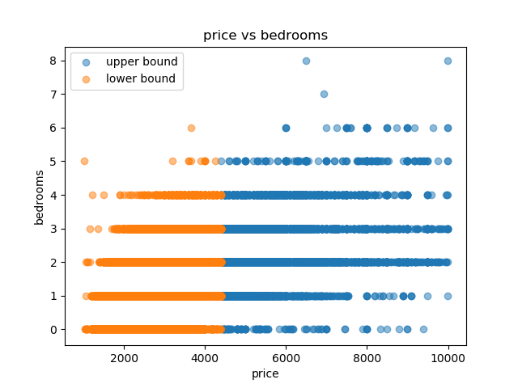

# df_percentile Package

## Background

This package can split a Pandas Dataframe into two groups by a specified percentile and column to split on.

It can be useful for identifying trends in data sets with features such as price or salary. 
E.g. in a NYC rent listing database with the following columns: price, bedrooms, bathrooms
```
In [7]: df.head()

Out[7]: 
   bedrooms  bathrooms  latitude  longitude  price
0         3        1.5   40.7145   -73.9425   3000
1         2        1.0   40.7947   -73.9667   5465
2         1        1.0   40.7388   -74.0018   2850
3         1        1.0   40.7539   -73.9677   3275
4         4        1.0   40.8241   -73.9493   3350
```
If you split the df by price, the scatter method can help you visualize the distribution of features such as bathrooms and bedrooms for the higher rent vs lower rent group.
The create_df will run a ttest on the two groups and whichever columns you specified as you instantiated the object, returning p-values with the means of the features.
It can also bootstrap from the two groups and create a histogram of the distribution of sample means, along with the 95% confidence intervals.

## Instructions

First initialize the object with:

1. **df_percentile(df, col_names, col_to_separate)** *bedrooms and bathrooms are the features you care about, separate by price*
```
In [10]: import dfpercentile

In [11]: from dfpercentile import df_percentile

In [12]: new_df = df_percentile(df, ['bedrooms','bathrooms'], 'price')
This dataframe is separated by price  
```

- **create_df(percentile)** *p-values were very small for the two groups when you split the rent price by the top 30 percentile*
```
In [13]: new_df.create_df(70)

Out[13]: 
           p-values  upper_bound_means  lower_bound_means
bedrooms        0.0           2.319909           1.159946
bathrooms       0.0           1.522683           1.030201
```

- **bootstrap(percentile, col_name, n_simulations = 10000, ci = 95)**
```
In [16]: new_df.bootstrap(70, 'RAA')    
# was used in a project of mine for splitting MLB relief pitchers by salary and measuring the group performance
```


- **bootstrap_stats()**
```
      In [6]: data.bootstrap_stats()

      The 95% confidence intervals for the upper bound group ranges from -1.1944029850746265 to 2.716417910447761.
      The lower bound group ranges from -2.529032258064516 and -0.44516129032258067.
      Means of the distribution: 
      Upper Bound Group: 0.7459731343283582
      Lower Bound Group:-1.4869800000000002
```

- **corr(percentile, col_name)**
```
In [25]: new_df.corr(95, 'bathrooms')

For the lower bound group: 
The correlation coefficent is 0.5437659981793554 and the p-value is 0.0
For the higher bound pitcher group: 
The correlation coefficent is 0.03580173165337624 and the p-value is 0.07722030909098343
```

- **scatter(percentile, col_name)**
```
In [39]: new_df.scatter(80, 'bedrooms')
```


